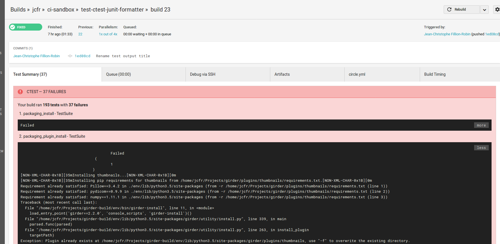

=======
Add-ons
=======

Each category is named after a CI worker (e.g appveyor) and references add-ons
designed to be used on the associated continuous integration service.

An add-on is a file that could either directly be executed or used as a
parameter for an other tool.

Anyci
-----

This a special category containing scripts that could be executed on a broad
range of CI services.

``ctest_junit_formatter``
^^^^^^^^^^^^^^^^^^^^^^^^^

Add-on converting test results from CTest to JUnit format.

The add-on get the name of the latest build tag by reading the
first line of <BUILD_DIR>/Testing/TAG, and then convert the
file <BUILD_DIR>/Testing/<LATEST_TAG>/Test.xml. The conversion
results is outputted on stdout.

Usage::

    ci_addons ctest_junit_formatter BUILD_DIR > JUnit.xml

Example of use from CircleCI::

    $ mkdir ${CIRCLE_TEST_REPORTS}/CTest
    $ ci_addons ctest_junit_formatter BUILD_DIR > ${CIRCLE_TEST_REPORTS}/CTest/JUnit-${CIRCLE_NODE_INDEX}.xml

Example of CircleCI report with failing tests:

``docker.py``
^^^^^^^^^^^^^

Add-on facilitating docker use on CI services.

It allows to load an image from local cache, pull and save back using
a convenience one-liner.

Usage::

    ci_addons docker load-pull-save [-h] [--cache-dir CACHE_DIR] [--verbose]
                                         NAME[:TAG|@DIGEST]

Example::

    $ ci_addons docker load-pull-save hello-world:latest
    [anyci:docker.py] Loading cached image from /home/jcfr/docker/hello-world-latest.tar
    [anyci:docker.py]   -> cached image not found
    [anyci:docker.py] Pulling image: hello-world:latest
    [anyci:docker.py]   -> done
    [anyci:docker.py] Reading image ID from current image
    [anyci:docker.py]   -> image ID: sha256:c54a2cc56cbb2f04003c1cd4507e118af7c0d340fe7e2720f70976c4b75237dc
    [anyci:docker.py] Caching image
    [anyci:docker.py]   -> image cached: /home/jcfr/docker/hello-world-latest.tar
    [anyci:docker.py] Saving image ID into /home/jcfr/docker/hello-world-latest.image_id
    [anyci:docker.py]   -> done

.. note::

    - Image is saved into the cache only if needed.

      In addition to the image archive (e.g `image-name.tar`), a file containing
      the image ID is also saved into the cache directory (e.g `image-name.image_id`).

      This allows to quickly read back the image ID of the cached image and determine if
      the current image should be saved into the cache.

``noop.py``
^^^^^^^^^^^

Display name of script and associated argument (basically the value of
``sys.argv``).

``publish_github_release.py``
^^^^^^^^^^^^^^^^^^^^^^^^^^^^^

Add-on automating the creation of GitHub releases.

Based on the git branch found in the current working directory, it allows to
automatically create a GitHub ``prerelease`` and/or ``release`` and upload
associated packages.

Getting Started
"""""""""""""""

To create a pre-release named ``latest``::

    ci_addons publish_github_release --prerelease-packages "dist/*"

To create a release named after the current tag::

    ci_addons publish_github_release --release-packages "dist/*"

In both case, packages found in *dist* directory are uploaded.

.. note::

    Pre-releases are created only if the current commit is *NOT* a tag (``latest`` tag is automatically
    ignored). Similarly, releases are created *ONLY* if current commit is a tag (different from ``latest``).

Terminology
"""""""""""

**Prerelease**: By default, this corresponds to a GitHub prerelease associated with a tag named
``latest`` and named ``Latest (updated on YYYY-MM-DD HH:MM UTC)``. The prerelease is automatically
updated each time the ``publish_github_release`` script is executed. Updating the ``latest``
prerelease means that (1) the latest tag is updated to point to the current HEAD, (2) the name is
updated and (3) latest packages are uploaded to replace the previous ones. GitHub prerelease are
basically release with *draft* option set to False and *prerelease* option set to True.

**Release**: This corresponds to a GitHub release automatically created by ``publish_github_release``
script only if it found that HEAD was associated with a tag different from ``latest``. It has both
*draft* and *prerelease* options set to False. Once packages have been associated with such a release,
they are not expected to be removed.

Usage
"""""

::

    ci_addons publish_github_release [-h]
                                     [--release-packages [PATTERN [PATTERN ...]]]
                                     [--prerelease-packages [PATTERN [PATTERN ...]]]
                                     [--prerelease-packages-clear-pattern PATTERN]
                                     [--prerelease-packages-keep-pattern PATTERN]
                                     [--prerelease-tag PRERELEASE_TAG]
                                     [--prerelease-name PRERELEASE_NAME]
                                     [--prerelease-sha PRERELEASE_SHA]
                                     [--token GITHUB_TOKEN]
                                     [--exit-success-if-missing-token]
                                     [--re-upload]
                                     [--display-python-wheel-platform]
                                     [--dry-run]
                                     ORG/PROJECT

.. note::

    - Packages to upload can be a list of paths or a list of globbing patterns.

Mini-language for packages selection
""""""""""""""""""""""""""""""""""""

To facilitate selection of specific packages, if any of the strings described below are
found in arguments associated with with either ``--prerelease-packages``
or ``--release-packages``, they will be replaced.

**<PYTHON_WHEEL_PLATFORM>**: This string is replaced by the current
platform as found in python wheel package names (e.g manylinux1, macosx, or win).
Executing ``ci_addons publish_github_release --display-python-wheel-platform``
returns the same string.

**<COMMIT_DATE>**: This string is replaced by the YYYYMMDD date
as returned by ``git show -s --format="%cd" --date=local``.

**<COMMIT_SHORT_SHA>**: This string is replaced by the sha
as returned by ``git rev-parse --short=7 HEAD``.

Use case: Automatic upload of release packages associated with a tag
""""""""""""""""""""""""""""""""""""""""""""""""""""""""""""""""""""

In this example, the script automatically detects that the current branch
HEAD is associated with the tag **1.0.0** and automatically uploads all
packages found in the ``dist`` directory.

::

    $ cd PROJECT

    $ git describe
    1.0.0

    $ ci_addons publish_github_release ORG/PROJECT \
      --release-packages "dist/*"
    Checking if HEAD is a release tag
    Checking if HEAD is a release tag - yes (found 1.0.0: creating release)

    created '1.0.0' release
      Tag name      : 1.0.0
      ID            : 5436107
      Created       : 2017-02-13T06:36:29Z
      URL           : https://github.com/ORG/PROJECT/releases/tag/1.0.0
      Author        : USERNAME
      Is published  : True
      Is prerelease : False

    uploading '1.0.0' release asset(s) (found 2):
      uploading dist/sandbox-1.0.0-cp27-cp27m-manylinux1.whl
      download_url: https://github.com/ORG/PROJECT/releases/download/1.0.0/sandbox-1.0.0-cp27-cp27m-manylinux1.whl

      uploading dist/sandbox-1.0.0-cp35-cp35m-manylinux1.whl
      download_url: https://github.com/ORG/PROJECT/releases/download/1.0.0/sandbox-1.0.0-cp35-cp35m-manylinux1.whl

Use case: Automatic creation of "nightly" prerelease from different build machines
""""""""""""""""""""""""""""""""""""""""""""""""""""""""""""""""""""""""""""""""""

When building projects using continuous integration services (e.g Appveyor,
TravicCI, or CircleCI), the *publish_github_release* script has the following
responsibilities:

* update the nightly tag reference
* update the release name
* keep only the most recent packages. This means that after successfully
  uploading package generating on a given platform, the older ones will be
  removed.

To fulfill its requirements, *publish_github_release* provides two
convenient options ``--prerelease-packages-clear-pattern`` and ``--prerelease-packages-keep-pattern``.

**prerelease-packages-clear-pattern**: This option allows to select all packages
that should be removed from the prerelease. For example, on a machine responsible
to generate windows python wheels, the following pattern can be used :``"*win*.whl"``.

**prerelease-packages-keep-pattern**: This option allows to keep packages
that have been selected by the previous globbing pattern. For example, assuming
development package names contain the date of the commit they are built from,
specifying a globbing pattern with the date allows to delete older packages while
keeping only the new ones built from that commit.

In the following example, we assume a prerelease done on 2017-02-12 with
16 packages (4 linux, 4 macosx, and 8 windows) already exists. The command
reported below corresponds to the execution of the script on a linux machine,
after one additional commit has been done the next day.

::

  $ cd PROJECT

  $ git describe
  1.0.0-2-g9d40177

  $ commit_date=$(git log -1 --format="%ad" --date=local | date +%Y%m%d)
  $ echo $commit_date
  20170213

  $ ci_addons publish_github_release ORG/PROJECT \
    --prerelease-packages dist/*.dev${commit_date}*manylinux1*.whl \
    --prerelease-packages-clear-pattern "*manylinux1*.whl" \
    --prerelease-packages-keep-pattern "*.dev${commit_date}*.whl"
  Checking if HEAD is a release tag
  Checking if HEAD is a release tag - no (creating prerelease)
  
  release nightly: already exists
  
  uploading 'nightly' release asset(s) (found 4):
    uploading dist/sandbox-1.0.0.dev20170213-cp27-cp27m-manylinux1_x86_64.whl
    download_url: https://github.com/ORG/PROJECT/releases/download/nightly/sandbox-1.0.0.dev20170213-cp27-cp27m-manylinux1_x86_64.whl
  
    uploading dist/sandbox-1.0.0.dev20170213-cp34-cp34m-manylinux1_x86_64.whl
    download_url: https://github.com/ORG/PROJECT/releases/download/nightly/sandbox-1.0.0.dev20170213-cp34-cp34m-manylinux1_x86_64.whl
  
    uploading dist/sandbox-1.0.0.dev20170213-cp35-cp35m-manylinux1_x86_64.whl
    download_url: https://github.com/ORG/PROJECT/releases/download/nightly/sandbox-1.0.0.dev20170213-cp35-cp35m-manylinux1_x86_64.whl
  
    uploading dist/sandbox-1.0.0.dev20170213-cp36-cp36m-manylinux1_x86_64.whl
    download_url: https://github.com/ORG/PROJECT/releases/download/nightly/sandbox-1.0.0.dev20170213-cp36-cp36m-manylinux1_x86_64.whl
  
  deleting 'nightly' release asset(s) (matched: 8, matched-but-keep: 4, not-matched: 12):
    deleting sandbox-1.0.0.dev20170212-cp27-cp27m-manylinux1_x86_64.whl
    deleting sandbox-1.0.0.dev20170212-cp34-cp34m-manylinux1_x86_64.whl
    deleting sandbox-1.0.0.dev20170212-cp35-cp35m-manylinux1_x86_64.whl
    deleting sandbox-1.0.0.dev20170212-cp36-cp36m-manylinux1_x86_64.whl
    nothing to delete
  
  resolved 'master' to '9d40177e6d3a69890de8ea359de2d02a943d2e10'
  updating 'nightly' release: 
    target_commitish: '62fe605938ff252e4ddee05b5209299a1aa9a39e' -> '9d40177e6d3a69890de8ea359de2d02a943d2e10'
    tag_name: 'nightly' -> 'nightly-tmp'
  
  deleting reference refs/tags/nightly
  updating 'nightly-tmp' release: 
    tag_name: 'nightly-tmp' -> 'nightly'
  
  deleting reference refs/tags/nightly-tmp
  updating 'nightly' release: 
    target_commitish: '62fe605938ff252e4ddee05b5209299a1aa9a39e' -> '9d40177e6d3a69890de8ea359de2d02a943d2e10'

Use case: Automatic creation of GitHub releases and prereleases
"""""""""""""""""""""""""""""""""""""""""""""""""""""""""""""""

This can be done by combining the options ``--release-packages``
and ``--prerelease-packages``.

Note also the use of ``--display-python-wheel-platform`` to automatically
get the current python platform.

For example::

  $ commit_date=$(git log -1 --format="%ad" --date=local | date +%Y%m%d)

  $ platform=$(ci_addons publish_github_release ORG/PROJECT --display-python-wheel-platform)
  $ echo $platform
  manylinux1

  $ ci_addons publish_github_release ORG/PROJECT \
      --release-packages "dist/*" \
      --prerelease-packages dist/*.dev${commit_date}*${platform}*.whl \
      --prerelease-packages-clear-pattern "*${platform}*.whl" \
      --prerelease-packages-keep-pattern "*.dev${commit_date}*.whl"

The same can also be achieved across platform using the convenient mini-language for package
selection::

  $ ci_addons publish_github_release ORG/PROJECT \
      --release-packages "dist/*" \
      --prerelease-packages "dist/*.dev<COMMIT_DATE>*<PYTHON_WHEEL_PLATFORM>*.whl" \
      --prerelease-packages-clear-pattern "*<PYTHON_WHEEL_PLATFORM>*.whl" \
      --prerelease-packages-keep-pattern "*.dev<COMMIT_DATE>*.whl"

Testing
"""""""

Since the add-on tests interact with GitHub API, there are not included in the
regular scikit-ci-addons collection of tests executed using pytest. Instead,
they needs to be manually executed following these steps:

(1) Generate a `personal access token <https://github.com/settings/tokens/new>`_
    with at least ``public_repo`` scope enabled.
(2) Create a *test* project on GitHub with at least one commit.
(3) Check out sources of your *test* project.
(4) Create a virtual environment, download scikit-ci-addons source code, and install its requirements.
(5) Execute the test script.

For example::

  export GITHUB_TOKEN=...   # Change this with the token generated above in step (1)
  TEST_PROJECT=jcfr/sandbox # Change this with the project name created above in step (2)

  cd /tmp
  git clone https://github.com/scikit-build/scikit-ci-addons
  cd scikit-ci-addons/
  mkvirtualenv scikit-ci-addons-test
  pip install -r requirements.txt
  SRC_DIR=$(pwd)

  cd /tmp
  git clone https://github.com/$TEST_PROJECT test-project
  cd test-project

  python $SRC_DIR/anyci/tests/test_publish_github_release.py $TEST_PROJECT --no-interactive

``run.sh``
^^^^^^^^^^

Wrapper script executing command and arguments passed as parameters.

Appveyor
--------

These scripts are designed to work on worker from http://appveyor.com/

``enable-worker-remote-access.ps1``
^^^^^^^^^^^^^^^^^^^^^^^^^^^^^^^^^^^

Enable access to the build worker via Remote Desktop.

Usage::

    - ci_addons --install ../
    - ps: ../appveyor/enable-worker-remote-access.ps1 [-block|-check_for_block]

Example::

    - ci_addons --install ../
    - ps: ../appveyor/enable-worker-remote-access.ps1 -block

.. note::

    - Calling this script will enable and display the Remote Desktop
      connection details. By default, the connection will be available
      for the length of the build.

    - Specifying ``-block`` option will ensure the connection remains
      open for at least 60 mins.

    - Specifying ``-check_for_block`` option will keep the connection
      open only if the environment variable ``BLOCK`` has been set to ``1``.

``install_cmake.py``
^^^^^^^^^^^^^^^^^^^^

Download and install in the PATH the specified version of CMake binaries.

Usage::

    ci_addons appveyor/install_cmake.py X.Y.Z

Example::

    $ ci_addons appveyor/install_cmake.py 3.6.2

.. note::

    - CMake archive is downloaded and extracted into ``C:\\cmake-X.Y.Z``. That
      same directory can then be added to the cache. See `Build Cache <https://www.appveyor.com/docs/build-cache/>`_
      documentation for more details.

    - ``C:\\cmake-X.Y.Z`` is prepended to the ``PATH``.
      TODO: Is the env global on AppVeyor ? Or does this work only with scikit-ci ?

``run-with-visual-studio.cmd``
^^^^^^^^^^^^^^^^^^^^^^^^^^^^^^

This is a wrapper script setting the Visual Studio environment
matching the selected version of Python. This is particularly
important when building Python C Extensions.

Usage::

    ci_addons --install ../
    ../appveyor/run-with-visual-studio.cmd \\path\\to\\command [arg1 [...]]

Example::

    SET PYTHON_DIR="C:\\Python35"
    SET PYTHON_VERSION="3.5.x"
    SET PYTHON_ARCH="64"
    SET PATH=%PYTHON_DIR%;%PYTHON_DIR%\\Scripts;%PATH%
    ci_addons --install ../
    ../appveyor/run-with-visual-studio.cmd python setup.by bdist_wheel

Author:

-  Olivier Grisel

License:

- `CC0 1.0 Universal <http://creativecommons.org/publicdomain/zero/1.0/>`_

.. note::

    - Python version selection is done by setting the ``PYTHON_VERSION`` and
      ``PYTHON_ARCH`` environment variables.

    - Possible values for  ``PYTHON_VERSION`` are:

      - ``"2.7.x"``

      - ``"3.4.x"``

      - ``"3.5.x"``

    - Possible values for ``PYTHON_ARCH`` are:

      - ``"32"``

      - ``"64"``

``patch_vs2008.py``
^^^^^^^^^^^^^^^^^^^

This script patches the installation of `Visual C++ 2008 Express <https://www.appveyor.com/docs/installed-software/#visual-studio-2008>`_
so that it can be used to build 64-bit projects.

Usage::

    ci_addons appveyor/patch_vs2008.py

Credits:

- Xia Wei, sunmast#gmail.com

Links:

- http://www.cppblog.com/xcpp/archive/2009/09/09/vc2008express_64bit_win7sdk.html

.. note::

    The add-on download `vs2008_patch.zip <https://github.com/menpo/condaci/raw/master/vs2008_patch.zip>`_
    and execute ``setup_x64.bat``.

``rolling-build.ps1``
^^^^^^^^^^^^^^^^^^^^^

Cancel on-going build if there is a newer build queued for the same PR

Usage:

.. code-block:: yaml

  - ps: rolling-build.ps1

.. note::

    - If there is a newer build queued for the same PR, cancel this one.
      The AppVeyor 'rollout builds' option is supposed to serve the same
      purpose but it is problematic because it tends to cancel builds pushed
      directly to master instead of just PR builds (or the converse).
      credits: JuliaLang developers.

``tweak_environment.py``
^^^^^^^^^^^^^^^^^^^^^^^^

Usage::

  ci_addons tweak_environment.py

.. note::

    - Update ``notepad++`` settings:

      - ``TabSetting.replaceBySpace`` set to ``yes``

Circle
------

These scripts are designed to work on worker from http://circleci.com/

``install_cmake.py``
^^^^^^^^^^^^^^^^^^^^

Download and install in the PATH the specified version of CMake binaries.

Usage::

    ci_addons appveyor/install_cmake.py X.Y.Z

Example::

    $ ci_addons appveyor/install_cmake.py 3.6.2

.. note::

    - The script will skip the download if current version matches the selected
      one.

Travis
------

These scripts are designed to work on worker from http://travis-ci.org/

``install_cmake.py``
^^^^^^^^^^^^^^^^^^^^

Download and install in the PATH the specified version of CMake binaries.

Usage::

    ci_addons appveyor/install_cmake.py X.Y.Z

Example::

    $ ci_addons appveyor/install_cmake.py 3.6.2

.. note::

    - The script automatically detects the operating system (``linux`` or ``osx``)
      and install CMake in a valid location.

    - The archives are downloaded in ``/home/travis/downloads`` to allow
      caching. See `Caching Dependencies and Directories <https://docs.travis-ci.com/user/caching/>`_
      The script the download if the correct CMake archive is found in ``/home/travis/downloads``.

    - Linux:

      - To support worker with and without ``sudo`` enabled, CMake is installed
        in ``HOME`` (i.e /home/travis). Since ``~/bin`` is already in the ``PATH``,
        CMake executables will be available in the PATH after running this script.

    - MacOSX:

      - Consider using this script only if the available version does **NOT**
        work for you. See the `Compilers-and-Build-toolchain <https://docs.travis-ci.com/user/osx-ci-environment/#Compilers-and-Build-toolchain>`_
        in Travis documentation.

      - What does this script do ? First, it removes the older version of CMake
        executable installed in ``/usr/local/bin``. Then, it installs the selected
        version of CMake using ``sudo cmake-gui --install``.

``install_pyenv.py``
^^^^^^^^^^^^^^^^^^^^

Usage::

  export PYTHON_VERSION=X.Y.Z
  ci_addons travis/install_pyenv.py

.. note::

    - Update the version of ``pyenv`` using ``brew``.

    - Install the version of python selected setting ``PYTHON_VERSION``
      environment variable.

``run-with-pyenv.sh``
^^^^^^^^^^^^^^^^^^^^^

This is a wrapper script setting the environment corresponding to the
version selected setting ``PYTHON_VERSION`` environment variable.

Usage::

    export PYTHON_VERSION=X.Y.Z
    ci_addons --install ../
    ../travis/run-with-pyenv.sh python --version

Windows
-------

These scripts are designed to work on any windows workstation running Windows 7 and above and can
be directly used from either command line terminal or a powershell terminal using a simple one-liner.

Content of the scripts can easily be inspected in the `associated source repository <https://github.com/scikit-build/scikit-ci-addons/tree/master/windows>`_.

For example, on a new system without python or git installed, the following can be done to
install them:

* from a windows command terminal open as administrator ::

    @powershell -ExecutionPolicy Unrestricted "iex ((new-object net.webclient).DownloadString('https://raw.githubusercontent.com/scikit-build/scikit-ci-addons/master/windows/install-python-36-x64.ps1'))"
    @powershell -ExecutionPolicy Unrestricted "iex ((new-object net.webclient).DownloadString('https://raw.githubusercontent.com/scikit-build/scikit-ci-addons/master/windows/install-git.ps1'))"

* or from a powershell terminal open as administrator: ::

    Set-ExecutionPolicy Unrestricted
    iex ((new-object net.webclient).DownloadString('https://raw.githubusercontent.com/scikit-build/scikit-ci-addons/master/windows/install-python-36-x64.ps1'))
    iex ((new-object net.webclient).DownloadString('https://raw.githubusercontent.com/scikit-build/scikit-ci-addons/master/windows/install-git.ps1'))

Read `here <https://technet.microsoft.com/en-us/library/ee176961.aspx>`_ to learn about the
powershell execution policy.

Details for each ``install-*.ps1`` scripts are reported below.

``install-cmake.ps1``
^^^^^^^^^^^^^^^^^^^^^

By default, install CMake 3.7.1 in directory ``C:\cmake-3.7.1``

.. note::

    - CMake is **NOT** added to the ``PATH``
    - setting ``$cmakeVersion`` to "X.Y.Z" before executing the script allows to select a specific CMake version.

``install-git.ps1``
^^^^^^^^^^^^^^^^^^^

Install Git 2.11.0 (including Git Bash) on the system.

.. note::

    - Git executables are added to the ``PATH``

``install-ninja.ps1``
^^^^^^^^^^^^^^^^^^^^^

Install ninja executable v1.7.2 into ``C:\ninja-1.7.2``.

.. note::

    - ninja executable is **NOT** added to the ``PATH``

``install-nsis.ps1``
^^^^^^^^^^^^^^^^^^^^

Install NSIS 3.01 on the system.

.. note::

    - nsis executable is added to the ``PATH``

``install-python.ps1``
^^^^^^^^^^^^^^^^^^^^^^

Install Python 2.7.12, 3.5.3 and 3.6.1 (32 and 64-bit) along with pip and virtualenv
in the following directories: ::

    C:\Python27-x64
    C:\Python27-x86

    C:\Python35-x64
    C:\Python35-x86

    C:\Python36-x64
    C:\Python36-x86

.. note::

    - python interpreter is **NOT** added to the ``PATH``
    - setting ``$pythonVersion`` to either "2.7", "3.5" or "3.6" before executing the script allows
      to install a specific version. By default, all are installed.
    - setting ``$pythonArch`` to either "86" or "64" before executing the script allows
      to install python for specific architecture. By default, both are installed.
    - setting ``$pythonPrependPath`` to 1 will add install and Scripts directories the PATH and .PY to PATHEXT. This
      variable should be set only if ``$pythonVersion`` and ``$pythonArch`` are set. By default, the value is 0.

``install-python-27-x64.ps1``
^^^^^^^^^^^^^^^^^^^^^^^^^^^^^

Install Python 3.6 64-bit and update the PATH.

This is equivalent to: ::

    $pythonVersion = "3.6"
    $pythonArch = "64"
    $pythonPrependPath = "1"
    .\install-python.ps1

.. note::

    - ``C:\Python27-x64`` and ``C:\Python27-x64\Scripts`` are prepended to the ``PATH``

``install-python-36-x64.ps1``
^^^^^^^^^^^^^^^^^^^^^^^^^^^^^

Install Python 2.7 64-bit and update the PATH.

This is equivalent to: ::

    $pythonVersion = "2.7"
    $pythonArch = "64"
    $pythonPrependPath = "1"
    .\install-python.ps1

.. note::

    - ``C:\Python36-x64`` and ``C:\Python36-x64\Scripts`` are prepended to the ``PATH``

``install-svn.ps1``
^^^^^^^^^^^^^^^^^^^^

Install `Slik SVN <https://sliksvn.com/download/>`_ 1.9.5 in the following directory: ::

    C:\SlikSvn

.. note::

    - svn executable is added to the ``PATH``

``install-utils.ps1``
^^^^^^^^^^^^^^^^^^^^^

This script is automatically included (and downloaded if needed) by the other addons, it
provides convenience functions useful to download and install programs:

  ``Always-Download-File($url, $file)``:

    Systematically download `$url` into `$file`.

  ``Download-File($url, $file)``:

    If file is not found, download `$url` into `$file`.

  ``Download-URL($url, $downloadDir)``:

    Download `$url` into `$downloadDir`. The filename is extracted from `$url`.

  ``Install-MSI($fileName, $downloadDir, $targetDir)``: 

    Programatically install MSI installers `$downloadDir\$fileName`
    into `$targetDir`. The package is installed for all users.

  ``Which($progName)``

    Search for `$progName` in the ``PATH`` and return its full path. 

  ``Download-7zip($downloadDir)``:

    If not found, download 7zip executable ``7za.exe`` into `$downloadDir`. The function
    returns the full path to the executable.

  ``Always-Extract-Zip($filePath, $destDir)``:

    Systematically extract zip file `$filePath` into `$destDir` using
    7zip. If 7zip executable ``7za.exe`` is not found in `$downloadDir`, it is downloaded
    using function ``Download-7zip``.

  ``Extract-Zip($filePath, $destDir)``:

    Extract zip file into `$destDir` only if `$destDir` does not exist.

